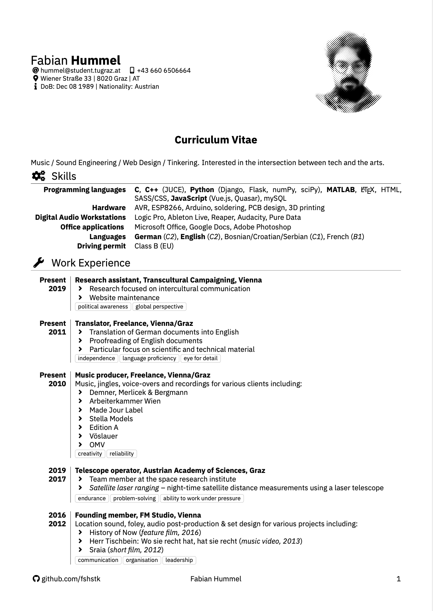
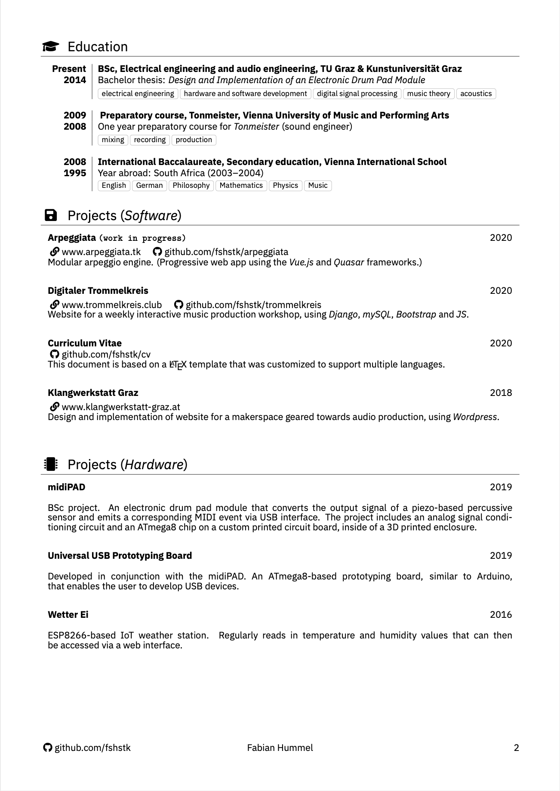

# Fabian Hummel – CV

Hi! You've stumbled onto the repository used for compiling my CV:

## About

This project uses the excellent [YAAC: Yet Another Awesome CV](https://github.com/darwiin/yaac-another-awesome-cv) package by Christophe Roger ([darwiin](https://github.com/darwiin)). Head on over there for technical details.

The document is in German or English, switching automatically depending on the
values of the variables \usinggerman & \usingenglish.

## License

The LaTeX class file _yaac-another-awesome-cv_ by Christophe Roger is published under the terms of the [LPPL Version 1.3c](https://www.latex-project.org/lppl.txt).

The example content files in Christophe's project are published under the terms of the [CC BY-SA 4.0 License](https://creativecommons.org/licenses/by-sa/4.0/legalcode), so the files in this project are, too.
